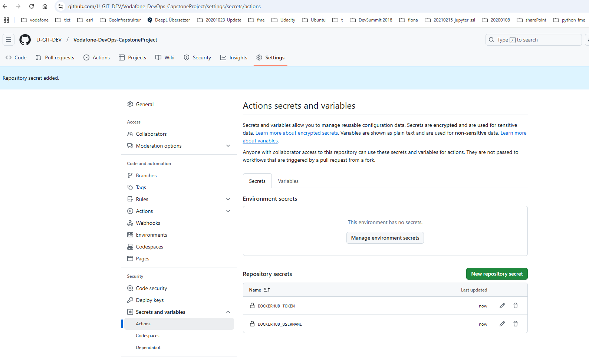
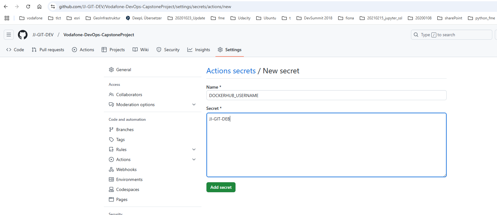

DevOps - Capstone Project Problem Statement (Jürgen Vorndran)
========================================


1. Check Terraform Version or Install Terraform
2. Terraform configuration 
3. Install Jenkins in the instance


Project:

Description

The goal is to utilize Ansible Configuration Management and CI/CD pipelines to automate the hosting of Docker containers on a Docker host. The objective is to streamline deployment, ensure scalability, and simplify maintenance for efficient container management.


Tools required:

• GitHub: To store Application source code
• Spring Boot Framework: To develop microservices-based applications
• GitHub Actions: CI/CD tool for automating builds and deploys
• AWS CLI: To connect with AWS for deploying Helm Charts
• Docker CLI: For testing Dockerfile for the Docker build process
• Ansible: For deploying Docker containers on a remote Docker host using Ansible Playbook
• Kubernetes: Kubernetes Cluster for deploying Containers

Expected Deliverables: 

Connect to the instance
Install Github-Action, Docker, Java and Python in the instance.

Step by Step

https://github.com/Sonal0409/CapstoneProject-Steps-Vodafone/blob/main/Step-by-step-process


-----------------------------------------------------
# Preparing the source code and designing the build process along with Dockerfile preparation 

Using the source code and test cases of a spring boot project at github repository https://github.com/Sonal0409/Vodafone-DevOps-CapstoneProject

### Create a github action for workflow building docker container

secret


### Create Dockerfile for build the container with a spring boot project

```Dockerfile
FROM tomcat:8
COPY target/java-example.war /usr/local/tomcat/webapps/ROOT.war
EXPOSE 8080
CMD ["catalina.sh", "run"]

```

### The github action workflow build the docker image, which push to dockerhub. We have to create secrets in github action

Steps are go to Settings tab of repository > go to secrets and variables > click on to Actions > Secrets Tab > Repository secrets > click on new repository secret


Create Variable DOCKERHUB_USERNAME



# Implementing Automated Test cases with the help of Junit and Selenium

# Designing GitHub actions pipeline script for performing CI CD workflow

# Integrating deploy stage to GitHub actions for performing deployment of containers on Kubernetes