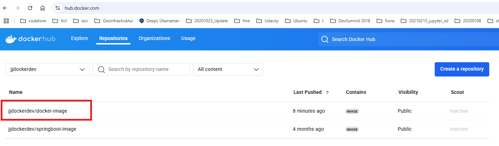
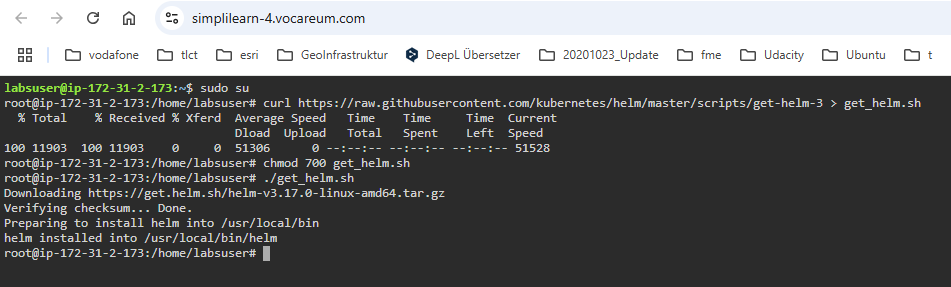
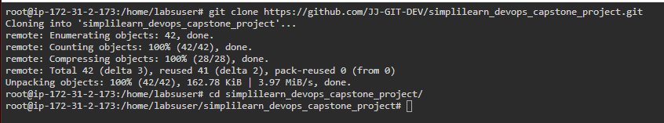
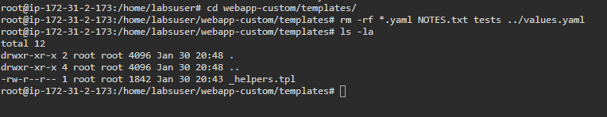

DevOps - Capstone Project Problem Statement (Jürgen Vorndran)
========================================


1. Check Terraform Version or Install Terraform
2. Terraform configuration 
3. Install Jenkins in the instance


Project:

Description

The goal is to utilize Ansible Configuration Management and CI/CD pipelines to automate the hosting of Docker containers on a Docker host. The objective is to streamline deployment, ensure scalability, and simplify maintenance for efficient container management.


Tools required:

• GitHub: To store Application source code
• Spring Boot Framework: To develop microservices-based applications
• GitHub Actions: CI/CD tool for automating builds and deploys
• AWS CLI: To connect with AWS for deploying Helm Charts
• Docker CLI: For testing Dockerfile for the Docker build process
• Ansible: For deploying Docker containers on a remote Docker host using Ansible Playbook
• Kubernetes: Kubernetes Cluster for deploying Containers

Expected Deliverables: 

Connect to the instance
Install Github-Action, Docker, Java and Python in the instance.

Step by Step

https://github.com/Sonal0409/CapstoneProject-Steps-Vodafone/blob/main/Step-by-step-process


-----------------------------------------------------
# Preparing the source code and designing the build process along with Dockerfile preparation 

Using the source code and test cases of a spring boot project at github repository https://github.com/Sonal0409/Vodafone-DevOps-CapstoneProject

### Create a github action for workflow building docker container

secret


### Create Dockerfile for build the container with a spring boot project

```Dockerfile
FROM tomcat:8
COPY target/java-example.war /usr/local/tomcat/webapps/ROOT.war
EXPOSE 8080
CMD ["catalina.sh", "run"]

```
### Designing GitHub actions pipeline script for performing CI CD workflow
### The github action workflow build the docker image, which push to dockerhub. We have to create secrets in github action

Steps are go to Settings tab of repository > go to secrets and variables > click on to Actions > Secrets Tab > Repository secrets > click on new repository secret


Create Variable DOCKERHUB_USERNAME


### After the github action run successful you will find the image on hub.docker



# Integrating deploy stage to GitHub actions for performing deployment of containers on Kubernetes

Create kubernetes Helm chart to deploy above image and push charts to github repo.
Helm uses a packaging format called charts, which are collections of files describing related Kubernetes resources. Charts can be packaged into versioned archives for deployment.

On the DevOps lab we will will install helm 
Execute below commands:
```bash
sudo su -
curl https://raw.githubusercontent.com/kubernetes/helm/master/scripts/get-helm-3 > get_helm.sh
chmod 700 get_helm.sh
./get_helm.sh
```



### clone github repository which we have to push the charts

```bash
git clone https://github.com/JJ-GIT-DEV/simplilearn_devops_capstone_project.git
ls
cd simplilearn_devops_capstone_project
```


### We now need to create a new Helm chart to deploy our custom Docker image. Use the following commands to create the new Helm chart.
```bash
helm create webapp-custom
ls -al webapp-custom
```


### By default, this Helm chart includes many files, but we will delete them to avoid errors during deployment

```bash
cd webapp-custom/templates
rm -rf *.yaml NOTES.txt tests ../values.yaml 
ls -la
```
