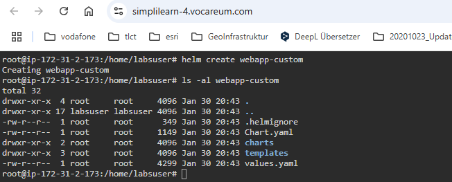

# Simplilearn - DevOps - Capstone Project Problem Statement (Jürgen Vorndran)
========================================

<strong>Project:</strong>

The goal is to utilize Ansible Configuration Management and CI/CD pipelines to automate the hosting of Docker containers on a Docker host. The objective is to streamline deployment, ensure scalability, and simplify maintenance for efficient container management.


<strong>Expected Deliverables:</strong>
- GitHub: To store Application source code
- Spring Boot Framework: To develop microservices-based applications
- GitHub Actions: CI/CD tool for automating builds and deploys
- AWS CLI: To connect with AWS for deploying Helm Charts
- Docker CLI: For testing Dockerfile for the Docker build process
- Ansible: For deploying Docker containers on a remote Docker host using Ansible Playbook
- Kubernetes: Kubernetes Cluster for deploying Containers

-----------------------------------------------------
# Creating a GitHub Action for Workflow Building Docker Container

Preparing the source code and designing the build process along with Dockerfile preparation 

We will using an existing Spring Boot project with the source code from github repository https://github.com/Sonal0409/Vodafone-DevOps-CapstoneProject

### Creating a Dockerfile for the Spring Boot Project
First, we’ll need to create a Dockerfile in the root directory of the Spring Boot project. Here’s the Dockerfile for a Spring Boot application:
```Dockerfile
FROM tomcat:8
COPY target/java-example.war /usr/local/tomcat/webapps/ROOT.war
EXPOSE 8080
CMD ["catalina.sh", "run"]
```

# Creating a GitHub Action for Workflow for upload the image to DockerHub

Next, we’ll need to create a GitHub Action workflow file. This file should be placed in the .github/workflows directory of your repository. Here’s the steps to do this on github.

### Create the Workflow File
\> Create a new file in .github/workflows directory with the name github_action_continous_integration.yml.


### Secrets with your Docker Hub credentials.
\> Go to Settings tab of the Repository > go to Secrets and variables > click on to Actions > Secrets Tab > Repository secrets > click on new repository secret


\> Create Variable DOCKERHUB_USERNAME and DOCKERHUB_TOKEN


\> After the github action run successful you will find the image on DockerHub (hub.docker.com)


# Integrating deploy stage to GitHub actions for performing deployment of containers on Kubernetes

Create kubernetes Helm chart to deploy above image and push charts to github repo.
Helm uses a packaging format called charts, which are collections of files describing related Kubernetes resources. Charts can be packaged into versioned archives for deployment.

# Integrating Deployment Stage to GitHub Actions for Kubernetes Deployment
To enable the deployment of containers on Kubernetes, we will integrate a deployment stage into our GitHub Actions workflow.

Create a Kubernetes Helm Chart: Develop a Helm chart to deploy the Docker image created in the previous steps. Helm uses a packaging format called charts, which are collections of files that describe related Kubernetes resources. These charts can be packaged into versioned archives for deployment.
Push Helm Charts to GitHub Repository: Once the Helm chart is created, push the charts to the GitHub repository for version control and easy access.

\> On the DevOps lab we will install helm 
Execute below commands:
```bash
sudo su -
curl https://raw.githubusercontent.com/kubernetes/helm/master/scripts/get-helm-3 > get_helm.sh
chmod 700 get_helm.sh
./get_helm.sh
```


\> Clone the Github repository to the DevOps Lab
```bash
git clone https://github.com/JJ-GIT-DEV/simplilearn_devops_capstone_project.git
ls
cd simplilearn_devops_capstone_project
```


\> We will create the Helm charts and update code to the repository. Use the following commands to create the new Helm chart.
```bash
helm create webapp-custom
ls -al webapp-custom
```


\> By default, this Helm chart includes many files, but we will delete them to avoid errors during deployment
```bash
cd webapp-custom/templates
rm -rf *.yaml NOTES.txt tests ../values.yaml 
ls -la
```


# Setting Up Infrastructure with Terraform: EC2 Instance for Kubernetes

Next step, we will use Terraform to automate the creation of an EC2 instance on AWS. 
This instance will serve as the foundation for installing and running Kubernetes with Helm, essential tools for container orchestration and management the application.

\> On the DevOps lab, we are install Terraform > ensure Terraform is installed

```bash
terraform --version

wget -O - https://apt.releases.hashicorp.com/gpg | sudo gpg --dearmor -o /usr/share/keyrings/hashicorp-archive-keyring.gpg
echo "deb [arch=$(dpkg --print-architecture) signed-by=/usr/share/keyrings/hashicorp-archive-keyring.gpg] https://apt.releases.hashicorp.com $(lsb_release -cs) main" | sudo tee /etc/apt/sources.list.d/hashicorp.list
sudo apt update && sudo apt install terraform
```


### Configure AWS Credentials - Set up your AWS credentials to allow Terraform to interact with your AWS account (IAM user, accesskey and secret key).
### In AWS 
\> IAM > Users > click on add user > give a username > click next > select Attach policies directly > select AdministratorAccess below >> click on next > click on create user.


Now lets attach access key and secret key to the user.

Click on username > click on security credentials > Select Access keys> click on create access key


\> select Command Line Interface (CLI)


\> click on I understand the above recommendation and want to proceed to create an access key. > press next > click on create access key


\> On the DevOps Lab create a Terraform Configuration File > Write a aws_infraaas.tf file to define the AWS provider, EC2 instance, and necessary security groups etc.. > the full configuration file can you find in this repository
```Terraform
provider "aws" {
    region = "us-east-1"
    access_key = "xxx"
    secret_key = "xxx"
} 

resource "aws_launch_configuration" "aws_autoscale_conf" {
  name          = "web_config"
  image_id      = "ami-0e1bed4f06a3b463d"
  instance_type = "t2.micro"
  security_groups =  [ "${aws_security_group.my_security_group.id}" ]
}

```

\> Initialize and Apply Terraform Configuration > Run terraform init to initialize the working directory containing the configuration files > Execute terraform apply to create the EC2 instance.
```bash
mkdir aws_infra
cd aws_infra
vim aws_infraaas.tf
terraform init
terraform apply
```


# ACHTUNG HIER GEHT ES WEITER!!!!!!!!!!!!!!!!!!!

\> Connect to the EC2 instance, we are create 


\> Install container on the EC2 instance
```bash
sudo su -

## Install Containerd

sudo wget https://raw.githubusercontent.com/lerndevops/labs/master/scripts/installContainerd.sh -P /tmp
sudo bash /tmp/installContainerd.sh
sudo systemctl restart containerd.service
```


\> Install kubeadm, kubelet, kubectl on the EC2 instance
```bash
mkdir /etc/apt/keyrings
sudo wget https://raw.githubusercontent.com/lerndevops/labs/master/scripts/installK8S.sh -P /tmp
sudo bash /tmp/installK8S.sh
```

\> Initialize kubernetes Master Node
```bash
sudo kubeadm init --ignore-preflight-errors=all
```


\> Execute the below commands for setting up your Kubernetes client configuration, allowing you to manage your Kubernetes cluster.
```bash
mkdir -p $HOME/.kube
sudo cp -i /etc/kubernetes/admin.conf $HOME/.kube/config
sudo chown $(id -u):$(id -g) $HOME/.kube/config
```


\> create kubectl network and check kube nodes exists
```bash
kubectl apply -f https://github.com/weaveworks/weave/releases/download/v2.8.1/weave-daemonset-k8s.yaml
kubectl taint nodes --all node-role.kubernetes.io/control-plane-
kubectl get nodes
```


\> Install also Helm 
```bash
curl https://raw.githubusercontent.com/kubernetes/helm/master/scripts/get-helm-3 > get_helm.sh
chmod 700 get_helm.sh
./get_helm.sh
```

\> Now we have to enable root password and root user authentication to proceed with SSH connectivity from GitHub actions pipeline. 
```bash
sed -i 's|PasswordAuthentication no|PasswordAuthentication yes|g' /etc/ssh/sshd_config
sed -i 's|#PermitRootLogin prohibit-password|PermitRootLogin yes|g' /etc/ssh/sshd_config
service sshd restart
passwd root

ssh root@localhost "date"
#	(Enter Root user password configured by you in previous command)
```


\> To run the github action also in k8s in aws ec2 instance you have to add in the github action > add the variables in the github secret variable HOST(ec2 instance public ip), USERNAME(root), PASSWORD(root) and PORT(22)
```yaml
      - name: Executing Kubectl command on Kubernetes Server Remotely
        uses: appleboy/ssh-action@v0.1.10
        with:
         host: ${{ secrets.HOST }}
         username: ${{ secrets.USERNAME }}
         password: ${{ secrets.PASSWORD }}
         port: ${{ secrets.PORT }}
         script: |
           git clone https://github.com/JJ-GIT-DEV/simplilearn_devops_capstone_project.git
           cd DevOps-Capstone-Project
           helm list -A
           helm install mavenbuild-dev ./webapp
           helm list -A
           kubectl get all
```


\> the kubernetes services are created 


