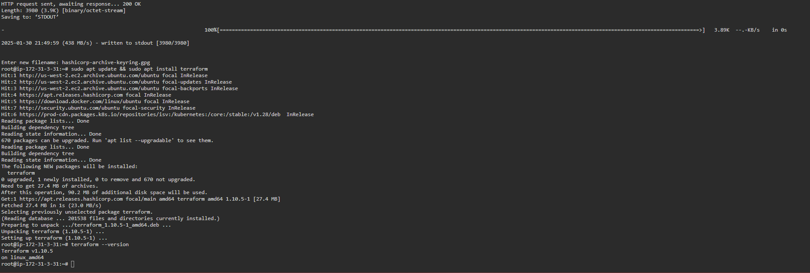
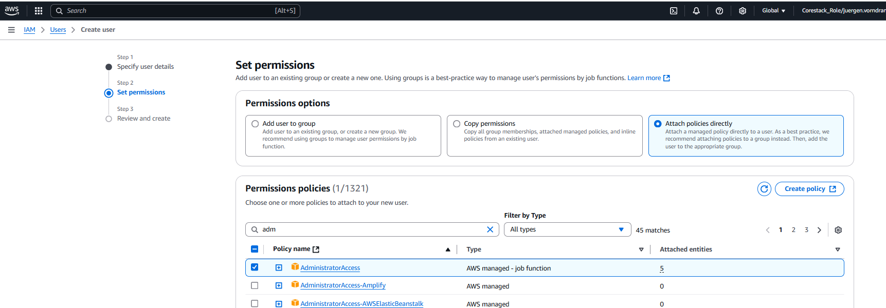

DevOps - Capstone Project Problem Statement (Jürgen Vorndran)
========================================


1. Check Terraform Version or Install Terraform
2. Terraform configuration 
3. Install Jenkins in the instance


Project:

Description

The goal is to utilize Ansible Configuration Management and CI/CD pipelines to automate the hosting of Docker containers on a Docker host. The objective is to streamline deployment, ensure scalability, and simplify maintenance for efficient container management.


Tools required:

• GitHub: To store Application source code
• Spring Boot Framework: To develop microservices-based applications
• GitHub Actions: CI/CD tool for automating builds and deploys
• AWS CLI: To connect with AWS for deploying Helm Charts
• Docker CLI: For testing Dockerfile for the Docker build process
• Ansible: For deploying Docker containers on a remote Docker host using Ansible Playbook
• Kubernetes: Kubernetes Cluster for deploying Containers

Expected Deliverables: 

Connect to the instance
Install Github-Action, Docker, Java and Python in the instance.

Step by Step

https://github.com/Sonal0409/CapstoneProject-Steps-Vodafone/blob/main/Step-by-step-process


-----------------------------------------------------
# Preparing the source code and designing the build process along with Dockerfile preparation 

Using the source code and test cases of a spring boot project at github repository https://github.com/Sonal0409/Vodafone-DevOps-CapstoneProject

### Create a github action for workflow building docker container


### Create Dockerfile for build the container with a spring boot project

```Dockerfile
FROM tomcat:8
COPY target/java-example.war /usr/local/tomcat/webapps/ROOT.war
EXPOSE 8080
CMD ["catalina.sh", "run"]

```
### Designing GitHub actions pipeline script for performing CI CD workflow
### The github action workflow build the docker image, which push to dockerhub. We have to create secrets in github action

Steps are go to Settings tab of repository > go to secrets and variables > click on to Actions > Secrets Tab > Repository secrets > click on new repository secret


Create Variable DOCKERHUB_USERNAME


### After the github action run successful you will find the image on hub.docker


# Integrating deploy stage to GitHub actions for performing deployment of containers on Kubernetes

Create kubernetes Helm chart to deploy above image and push charts to github repo.
Helm uses a packaging format called charts, which are collections of files describing related Kubernetes resources. Charts can be packaged into versioned archives for deployment.

On the DevOps lab we will will install helm 
Execute below commands:
```bash
sudo su -
curl https://raw.githubusercontent.com/kubernetes/helm/master/scripts/get-helm-3 > get_helm.sh
chmod 700 get_helm.sh
./get_helm.sh
```


### clone github repository which we have to push the charts

```bash
git clone https://github.com/JJ-GIT-DEV/simplilearn_devops_capstone_project.git
ls
cd simplilearn_devops_capstone_project
```


### We now need to create a new Helm chart to deploy our custom Docker image. Use the following commands to create the new Helm chart.
```bash
helm create webapp-custom
ls -al webapp-custom
```


### By default, this Helm chart includes many files, but we will delete them to avoid errors during deployment

```bash
cd webapp-custom/templates
rm -rf *.yaml NOTES.txt tests ../values.yaml 
ls -la
```


### Using terraform to create infrastructure - Ec2 instance where we will install kubernetes and docker.

### Install terraform DevOps lab

```bash
wget -O - https://apt.releases.hashicorp.com/gpg | sudo gpg --dearmor -o /usr/share/keyrings/hashicorp-archive-keyring.gpg
echo "deb [arch=$(dpkg --print-architecture) signed-by=/usr/share/keyrings/hashicorp-archive-keyring.gpg] https://apt.releases.hashicorp.com $(lsb_release -cs) main" | sudo tee /etc/apt/sources.list.d/hashicorp.list
sudo apt update && sudo apt install terraform
```
or
```bash

echo "deb [signed-by=/etc/apt/keyrings/kubernetes-apt-keyring.gpg] https://pkgs.k8s.io/core:/stable:/v1.28/deb/ /" | sudo tee /etc/apt/sources.list.d/kubernetes.list
mkdir /etc/apt/keyrings
curl -fsSL https://pkgs.k8s.io/core:/stable:/v1.28/deb/Release.key | sudo gpg --dearmor -o /etc/apt/keyrings/kubernetes-apt-keyring.gpg
sudo apt-get update
```





### Before the terraform deploymnet can be work. We have to launch the AWS devops lab and create IAM user, accesskey and secret key

In AWS 

IAM > Users > click on add user > give a username > click next > select Attach policies directly > select AdministratorAccess below >> click on next > click on create user.




Now lets attach access key and secret key to the user.

Click on username>> click on security credentials > Select Access keys> click on create access key

> select Command Line Interface (CLI)

> click on I understand the above recommendation and want to proceed to create an access key. > press next > click on create access key


### use the access key and secret key int the terrafrom provider block. You will find it in the file aws_infraaas.tf

### create a folder in devops lab machine for the terraform configuration for the aws infrastructure as service. The configuration are in the file aws_infraaas.tf in this repository, with the provider information and the access and secret key form aws

```bash
mkdir aws_infra
cd aws_infra
vim aws_infraaas.tf
terraform init
terraform apply
```


# Step 6: Go to AWS lab and connect to the instance

> install kubernetes on the Ec2 instance

### connect to the Ec2 instance, we are create


```bash
sudo su -

## Install Containerd

sudo wget https://raw.githubusercontent.com/lerndevops/labs/master/scripts/installContainerd.sh -P /tmp
sudo bash /tmp/installContainerd.sh
sudo systemctl restart containerd.service
```


### Install kubeadm,kubelet,kubectl
```bash - obsolate not work
mkdir /etc/apt/keyrings
sudo wget https://raw.githubusercontent.com/lerndevops/labs/master/scripts/installK8S.sh -P /tmp
sudo bash /tmp/installK8S.sh
```

## Initialize kubernetes Master Node
```bash
sudo kubeadm init --ignore-preflight-errors=all
```


### Execute the below commands to setup kubectl and apiserver communication
```bash
mkdir -p $HOME/.kube
sudo cp -i /etc/kubernetes/admin.conf $HOME/.kube/config
sudo chown $(id -u):$(id -g) $HOME/.kube/config
```


### create kubectl network. check kube nodes exists
```bash
kubectl apply -f https://github.com/weaveworks/weave/releases/download/v2.8.1/weave-daemonset-k8s.yaml
kubectl taint nodes --all node-role.kubernetes.io/control-plane-
kubectl get nodes
```


> We also need to install Helm utility using below set of commands:
```bash
curl https://raw.githubusercontent.com/kubernetes/helm/master/scripts/get-helm-3 > get_helm.sh
chmod 700 get_helm.sh
./get_helm.sh
```

### Now we have to enable root password and root user authentication to proceed with SSH connectivity from GitHub actions pipeline. 
```bash
sed -i 's|PasswordAuthentication no|PasswordAuthentication yes|g' /etc/ssh/sshd_config
sed -i 's|#PermitRootLogin prohibit-password|PermitRootLogin yes|g' /etc/ssh/sshd_config
service sshd restart
passwd root
#   secret: 12qwasER!
ssh root@localhost "date"
#	(Enter Root user password configured by you in previous command)
```


# is the connection not work you have to copy the ssh key in authorized keys file
## cat /root/.ssh/id_rsa.pub
## echo "key" >> ~/.ssh/authorized_keys


### To run the github action also in k8s in aws ec2 instance you have to add in the github action
### add the variables in the github secret variable HOST(ec2 instance public ip), USERNAME(root), PASSWORD(root) and PORT(22)
```yaml
      - name: Executing Kubectl command on Kubernetes Server Remotely
        uses: appleboy/ssh-action@v0.1.10
        with:
         host: ${{ secrets.HOST }}
         username: ${{ secrets.USERNAME }}
         password: ${{ secrets.PASSWORD }}
         port: ${{ secrets.PORT }}
         script: |
           git clone https://github.com/JJ-GIT-DEV/simplilearn_devops_capstone_project.git
           cd DevOps-Capstone-Project
           helm list -A
           helm install mavenbuild-dev ./webapp
           helm list -A
           kubectl get all
```


### the k8s service are created 


#apt-get update && apt-get install -y curl apt-transport-https
#sudo mkdir -p /etc/apt/keyrings
#curl -fsSL https://download.docker.com/linux/ubuntu/gpg | sudo gpg --dearmor -o /etc/apt/keyrings/docker.gpg
#echo "deb [arch=$(dpkg --print-architecture) signed-by=/etc/apt/keyrings/docker.gpg] https://download.docker.com/linux/ubuntu $(lsb_release -cs) stable" | sudo tee /etc/apt/sources.list.d/docker.list > /dev/null
#sudo apt-get update
#sudo apt-get install -y containerd.io docker-ce

#curl -s https://packages.cloud.google.com/apt/doc/yum-key.gpg | apt-key add -
#echo "deb http://apt.kubernetes.io/ kubernetes-xenial main" >/etc/apt/sources.list.d/kubernetes.list
#apt-get update
#apt -y install kubeadm kubectl kubelet